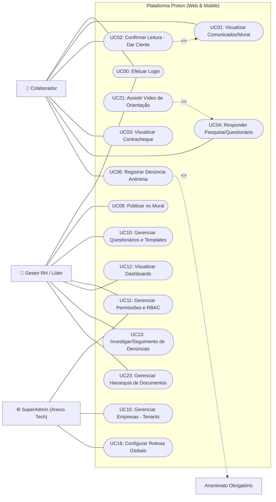

```mermaid
graph LR
    %% Definição de Atores (Estilo Stickman aproximado em Mermaid)
    C["👤 Colaborador"]
    RH["💼 Gestor RH / Líder"]
    SA["🌐 SuperAdmin (Anexo Tech)"]

    subgraph "Plataforma Proton (Web & Mobile)"
        %% Casos de Uso
        UC00([UC00: Efetuar Login])
        UC01([UC01: Visualizar Comunicados/Mural])
        UC02([UC02: Confirmar Leitura - Dar Ciente])
        UC03([UC03: Visualizar Contracheque])
        
        UC04([UC04: Responder Pesquisa/Questionário])
        UC21([UC21: Assistir Vídeo de Orientação])
        
        UC06([UC06: Registrar Denúncia Anônima])
        
        UC09([UC09: Publicar no Mural])
        UC10([UC10: Gerenciar Questionários e Templates])
        UC11([UC11: Gerenciar Permissões e RBAC])
        UC12([UC12: Visualizar Dashboards])
        UC13([UC13: Investigar/Seguimento de Denúncias])
        UC23([UC23: Gerenciar Hierarquia de Documentos])
        
        UC15([UC15: Gerenciar Empresas - Tenants])
        UC16([UC16: Configurar Rotinas Globais])
    end

    %% Associações: Colaborador
    C --- UC00 
    C --- UC01 
    C --- UC02
    C --- UC03
    C --- UC04 
    C --- UC06 

    %% Associações: Gestor RH
    RH --- UC00 
    RH --- UC09  
    RH --- UC10 
    RH --- UC11 
    RH --- UC12
    RH --- UC13
    RH --- UC23

    %% Associações: SuperAdmin
    SA --- UC11
    SA --- UC15 
    SA --- UC16

    %% Relacionamentos
    UC02 -.->|"<<include>>"| UC01
    UC21 -.->|"<<include>>"| UC04
    UC06 -.->|"<<rule>>"| UC24[Anonimato Obrigatório]
```