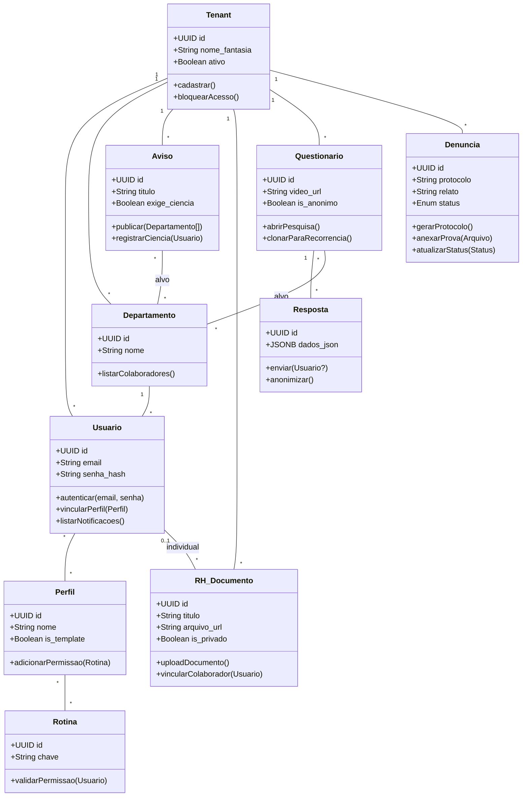

# Diagrama de Classes UML - Projeto Proton

Este diagrama detalha a estrutura de classes, atributos e métodos, alinhando a lógica de negócio com os requisitos do MVP.

## 1. Diagrama de Classes (Mermaid)

## 2. Destaques da Lógica de Negócio

1.  **Segmentação:** `Aviso` e `Questionario` possuem métodos para definir o público-alvo através da classe `Departamento`.
2.  **Segurança (RBAC):** A classe `Rotina` centraliza a validação de acesso, garantindo que o sistema seja modular.
3.  **Anonimato:** A classe `Resposta` possui o método `anonimizar()`, que garante que o `Usuario` não seja vinculado em pesquisas sensíveis.
4.  **Protocolo:** `Denuncia` gera um código único (`protocolo`) para acompanhamento sem identificar o autor.
