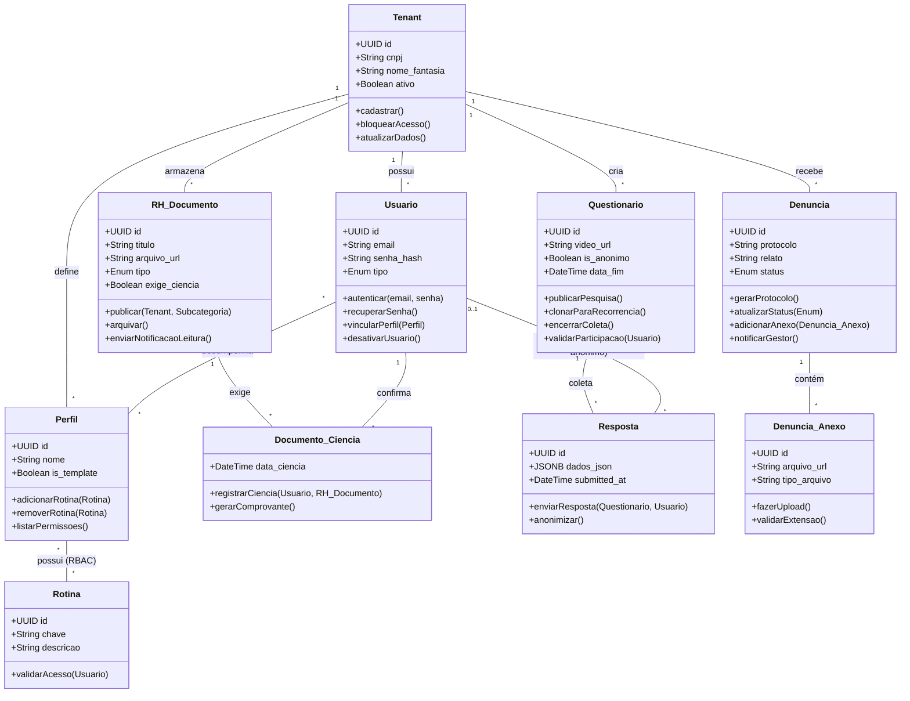

# Diagrama de Classes UML (v2 - Com Métodos) - Projeto Proton

Este diagrama detalha a estrutura de classes e seus comportamentos (métodos) para a implementação do sistema.

### 🛠️ Principais Comportamentos Adicionados:

1.  **Segurança (RBAC):** A classe `Usuario` agora tem `vincularPerfil()` e `autenticar()`, enquanto a `Rotina` possui `validarAcesso(Usuario)`, fechando o ciclo de segurança.
2.  **Módulo de Denúncia:** Adicionados `gerarProtocolo()` e `notificarGestor()`. Note que a denúncia não tem método para identificar o autor, preservando o anonimato.
3.  **Conformidade (Mural):** `RH_Documento` ganhou `enviarNotificacaoLeitura()` e `Documento_Ciencia` tem `gerarComprovante()`.
4.  **Flexibilidade de Pesquisas:** `Questionario` possui `clonarParaRecorrencia()` (para pesquisas anuais/mensais) e `validarParticipacao()` (para evitar duplicidade).
