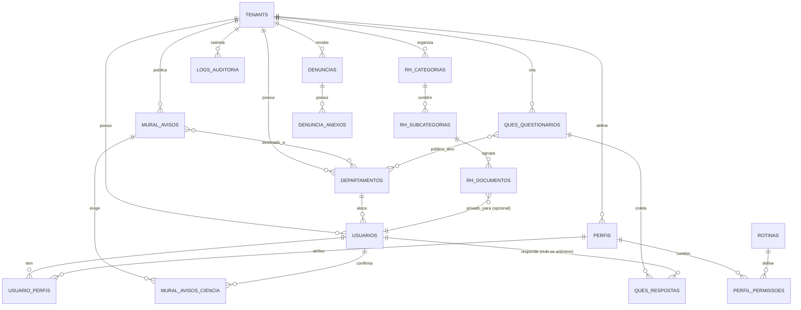

# Diagrama de Entidade-Relacionamento (ER) - Projeto AnexoTech

Este documento descreve a estrutura física do banco de dados PostgreSQL (v13+), projetada para multi-tenancy, RBAC e anonimato real.

## 1. Diagrama Visual (Mermaid)

## 2. Dicionário de Dados Resumido (20 Tabelas)

### Módulo Core & Acesso (RBAC)
1.  **tenants**: Empresas clientes.
2.  **departamentos**: Setores para segmentação (Público-Alvo).
3.  **usuarios**: Cadastro central de pessoas.
4.  **rotinas**: Chaves de funcionalidades (Ex: `VER_DENUNCIA`).
5.  **perfis**: Papéis de acesso (Ex: RH, Operacional).
6.  **perfil_permissoes**: Ligação N:N entre Perfis e Rotinas.
7.  **usuario_perfis**: Ligação N:N entre Usuários e Perfis.

### Módulo de Comunicação (Mural)
8.  **mural_avisos**: Comunicados e notícias.
9.  **mural_avisos_departamentos**: Segmentação de avisos por setor.
10. **mural_avisos_ciencia**: Registro de "Ciente" (Data/Hora/Usuário).

### Módulo de RH (Documentos)
11. **rh_categorias**: Nível 1 da hierarquia (Ex: Políticas).
12. **rh_subcategorias**: Nível 2 da hierarquia (Ex: Código de Ética).
13. **rh_documentos**: Nível 3. PDF final ou Contracheque individual.

### Módulo de Questionários
14. **ques_templates**: Modelos JSON reutilizáveis.
15. **ques_questionarios**: Pesquisas ativas (Vídeo, Anonimato).
16. **ques_questionarios_departamentos**: Público-Alvo das pesquisas.
17. **ques_respostas**: Respostas (JSONB) - `usuario_id` nulo se anônimo.

### Módulo de Ética & Governança
18. **denuncias**: Relatos 100% anônimos (Sem `usuario_id`).
19. **denuncia_anexos**: Provas (Fotos, Áudios, Documentos).
20. **logs_auditoria**: Rastro completo para conformidade LGPD.
