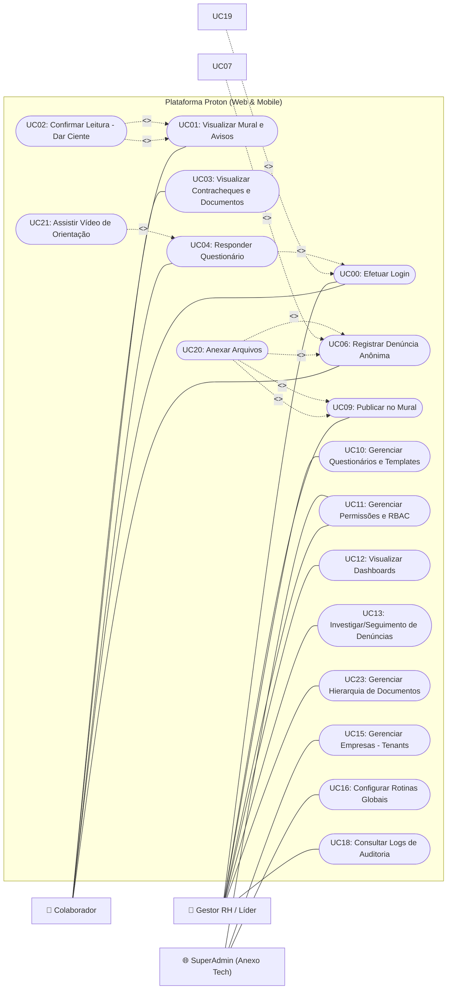

# Documentação Técnica: Diagrama de Casos de Uso (Geral) - Projeto Proton

**Versão:** 1.0 (Revisão Técnica Final - Sintaxe Mermaid)  
**Status:** Aprovado

---

## 1. Diagrama de Caso de Uso (Mermaid)

---

## 2. Descrição Detalhada dos Casos de Uso Críticos

| ID | Caso de Uso | Ator Principal | Descrição |
| :--- | :--- | :--- | :--- |
| **UC02** | Dar Ciente | Colaborador | O sistema registra o ID do usuário e o timestamp no momento em que ele confirma a leitura de um documento obrigatório. |
| **UC07** | Ativar Anonimato | Colaborador | Ao marcar esta opção, o sistema rompe o vínculo entre o `usuario_id` e a denúncia, gerando apenas um token de acompanhamento. |
| **UC11** | Gerenciar RBAC | RH | O Admin da empresa define quais perfis podem acessar rotinas sensíveis (ex: ver denúncias de líderes). |
| **UC18** | Consultar Logs | RH / SuperAdmin | Rastreabilidade de quem alterou perfis, excluiu usuários ou acessou dados sensíveis, conforme RNF04. |

---

## 3. Notas de Implementação
1.  **Sincronização:** O UC08 deve funcionar via chave de acesso (protocolo) para garantir que denunciantes anônimos não precisem de login para acompanhar o status.
2.  **Segurança:** O UC19 (2FA) é uma extensão do login e deve ser disparado automaticamente para perfis com permissões administrativas.
