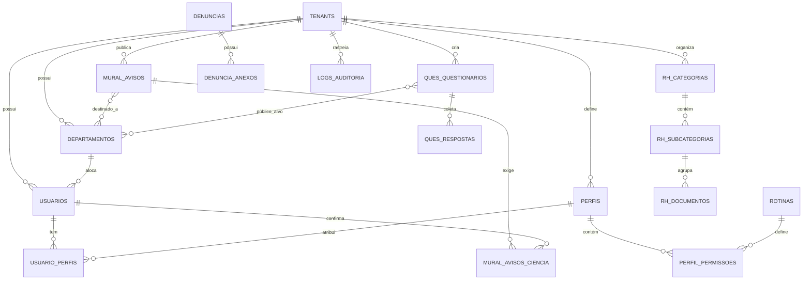

# Guia de Banco de Dados: Projeto Proton (projeto55)

Este documento une a estrutura técnica (as 20 tabelas) com o histórico de dúvidas e decisões de negócio tomadas durante o planejamento.

---

### 📋 1. Dicionário de Tabelas (O que temos no Banco?)

#### Módulo Core e Acesso
1.  **`tenants`**: Cadastro de empresas clientes (Multi-tenancy).
2.  **`departamentos`**: Setores das empresas. Permite segmentar avisos e pesquisas.
3.  **`usuarios`**: Cadastro central de pessoas (sem "tipo" fixo, usa Perfis).
4.  **`rotinas`**: Lista técnica de funcionalidades do sistema (Ex: `VER_DENUNCIA`).
5.  **`perfis`**: Papéis de acesso (Ex: Líder, RH, Operacional).
6.  **`perfil_permissoes`**: Liga Perfis a Rotinas.
7.  **`usuario_perfis`**: Liga Usuários a Perfis.

#### Módulo de Comunicação (Mural)
8.  **`mural_avisos`**: Comunicados e notícias da empresa.
9.  **`mural_avisos_departamentos`**: Define quais setores veem o aviso (Público-Alvo).
10. **`mural_avisos_ciencia`**: Registro de conformidade (Ciente).

#### Módulo de RH (Documentos)
11. **`rh_categorias`**: Nível 1 da hierarquia (Ex: Políticas Internas).
12. **`rh_subcategorias`**: Nível 2 (Ex: Código de Ética).
13. **`rh_documentos`**: Nível 3. Arquivo final (PDF) ou Contracheque.

#### Módulo de Questionários (Pesquisas)
14. **`ques_templates`**: Modelos prontos de perguntas reutilizáveis.
15. **`ques_questionarios`**: Pesquisas ativas (vídeo, anonimato, agendamento).
16. **`ques_questionarios_departamentos`**: Público-Alvo das pesquisas.
17. **`ques_respostas`**: Respostas (JSONB) com suporte a anonimato real.

#### Módulo Ético (Denúncias)
18. **`denuncias`**: Relatos 100% anônimos rastreados via protocolo.
19. **`denuncia_anexos`**: Fotos e documentos enviados como prova.

#### Módulo de Governança
20. **`logs_auditoria`**: Rastro de segurança (LGPD e Auditoria).

---

### ❓ 2. Histórico de Dúvidas e Decisões (FAQ)

**Q1: Por que o Código de Ética é Nível 2 e não Nível 1?**
*Resposta:* Para manter a hierarquia profissional de 3 níveis, permitindo que o RH adicione vários manuais sob o mesmo tema (Compliance > Código > PDF).

**Q2: O que é a "Flag do Anonimato" (`is_anonimo`)?**
*Resposta:* Se ativado, o banco proíbe a gravação do `usuario_id` na resposta, garantindo confiança para pesquisas sensíveis.

**Q3: O que significa a flag `is_template` em Perfis?**
*Resposta:* Indica que o perfil é um "molde" global. Empresas novas ganham cópias desses moldes automaticamente.

**Q4: Por que Departamentos virou uma tabela e não apenas um texto?**
*Resposta:* Para evitar erros e permitir o uso de **Público-Alvo** (enviar avisos para múltiplos setores simultaneamente).

**Q5: Por que repetir o `tenant_id` em tabelas como `rh_documentos`?**
*Resposta:* Segurança defensiva (Multi-tenancy). Garante isolamento total e impede vazamento de dados entre empresas.

---

### 🗺️ 3. Diagrama de Entidade-Relacionamento (ER) - v5.1

---

### 🛡️ 4. Guia de Defesa e Argumentação (Apresentação)

#### O que é este Diagrama?
- **Conceito:** É o projeto arquitetônico do sistema. Mostra as "coisas" (Entidades) e como elas se conectam (Relacionamentos).
- **Técnica:** É a representação lógica do banco de dados para garantir que a informação seja segura, organizada e sem duplicidade.

#### Como Defender este Projeto (Pilares):

1.  **Multi-tenancy (Segurança):** "Nosso banco é isolado por empresa (`tenant_id`). Os dados da Empresa A nunca se misturam com a Empresa B."
2.  **Público-Alvo (Segmentação):** "Diferente de sistemas básicos, permitimos que o RH direcione avisos e pesquisas para departamentos específicos (N:N), evitando poluição de dados para o colaborador."
3.  **RBAC (Acesso Profissional):** "Usamos o padrão de Perfis e Rotinas. A segurança não é baseada na pessoa, mas no cargo, tornando o sistema escalável e auditável."
4.  **Anonimato Real (Compliance):** "O Canal de Denúncias não tem nenhuma ligação técnica com a tabela de usuários. Cumprimos a LGPD e garantimos o sigilo total do denunciante."
5.  **Hierarquia de 3 Níveis (Organização):** "A estrutura `Categoria > Subcategoria > Documento` permite uma gestão de RH profissional e organizada para milhares de arquivos."
