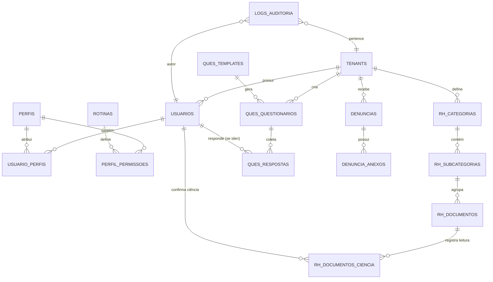

# Modelo de Dados Final (DER) - Projeto Proton (projeto55)

Este documento representa a arquitetura de dados consolidada e final para a Atividade 3, atendendo a todos os Requisitos Funcionais (RF) e Não Funcionais (RNF) do MVP.

## 1. Diagrama Conceitual (Mermaid)

---

## 2. Dicionário de Dados (Estrutura de Tabelas)

### 2.1. Núcleo de Multi-tenancy e Acesso (RBAC)
| Tabela | Descrição | Campos Chave |
| :--- | :--- | :--- |
| **tenants** | Empresas clientes (RF01/RF02) | `id`, `cnpj`, `nome_fantasia`, `ativo` |
| **usuarios** | Colaboradores e Admins (RF05/RF12) | `id`, `tenant_id`, `email`, `senha_hash`, `tipo` |
| **perfis** | Perfis de acesso (ex: "RH", "Líder") (RF08) | `id`, `tenant_id`, `nome`, `is_template` |
| **rotinas** | Funcionalidades do sistema (RF09/RF49) | `id`, `chave` (ex: `DOC_READ`), `descricao` |
| **perfil_permissoes** | Ligação Perfil x Rotina (RF09) | `perfil_id`, `rotina_id` |

### 2.2. Módulo de RH e Documentos (Hierarquia de 3 Níveis)
| Tabela | Descrição | Campos Chave |
| :--- | :--- | :--- |
| **rh_categorias** | Nível 1 da hierarquia (RF45) | `id`, `tenant_id`, `nome` |
| **rh_subcategorias** | Nível 2 da hierarquia (RF45) | `id`, `categoria_id`, `nome` |
| **rh_documentos** | Nível 3 (Documentos/Contracheques) (RF45/46) | `id`, `subcategoria_id`, `titulo`, `arquivo_url`, `tipo`, `usuario_id` (null se público), `exige_ciencia` |
| **rh_documentos_ciencia** | Registro de confirmação (RF30/32) | `documento_id`, `usuario_id`, `data_ciencia` |

### 2.3. Módulo de Questionários e Pesquisas
| Tabela | Descrição | Campos Chave |
| :--- | :--- | :--- |
| **ques_templates** | Modelos padrão reutilizáveis (RF15) | `id`, `titulo`, `estrutura_json` |
| **ques_questionarios** | Pesquisas ativas (RF15/18/20) | `id`, `tenant_id`, `template_id`, `video_url`, `is_anonimo`, `recorrencia_pai_id` |
| **ques_respostas** | Respostas dos usuários (RF16/19/21) | `id`, `questionario_id`, `usuario_id` (null se anônimo), `dados_json` (Híbrido) |

### 2.4. Módulo de Denúncias (Anonimato Estrito)
| Tabela | Descrição | Campos Chave |
| :--- | :--- | :--- |
| **denuncias** | Relatos anônimos (RF22/23/25) | `id`, `tenant_id`, `protocolo`, `relato`, `status`, `created_at` |
| **denuncia_anexos** | Arquivos das denúncias (RF24) | `id`, `denuncia_id`, `arquivo_url`, `tipo_arquivo` |

### 2.5. Auditoria e Segurança
| Tabela | Descrição | Campos Chave |
| :--- | :--- | :--- |
| **logs_auditoria** | Rastreabilidade de ações (RNF04/RF14) | `id`, `tenant_id`, `usuario_id`, `acao`, `contexto_json`, `created_at` |

---

## 3. Justificativas de Design (Garantia de Requisitos)

1.  **Anonimato Real (RNF02):** A tabela `denuncias` NÃO possui `usuario_id`. O denunciante acessa via `protocolo` gerado aleatoriamente. Não há como rastrear o autor via banco de dados.
2.  **Isolamento (RF02):** Todas as tabelas operacionais possuem `tenant_id`, permitindo filtros de segurança em todas as queries (Row Level Security no PostgreSQL).
3.  **Híbrido (RF19):** O uso de campos `JSONB` nas tabelas de `ques_templates` e `ques_respostas` permite que uma mesma pesquisa tenha perguntas de múltipla escolha e textos livres sem mudar o esquema do banco.
4.  **Hierarquia de RH (RF45):** A estrutura em 3 níveis (Categorias > Subcategorias > Documentos) foi implementada com chaves estrangeiras (`FK`) garantindo a integridade referencial.
5.  **Contracheques (RF46):** A tabela `rh_documentos` possui um `usuario_id` opcional. Se preenchido, o documento é privado (apenas o dono vê). Se nulo, é um documento público da subcategoria (Mural).
